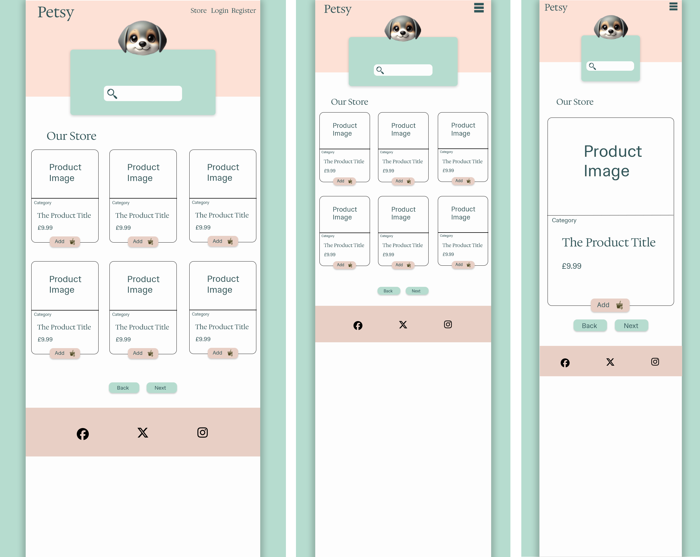
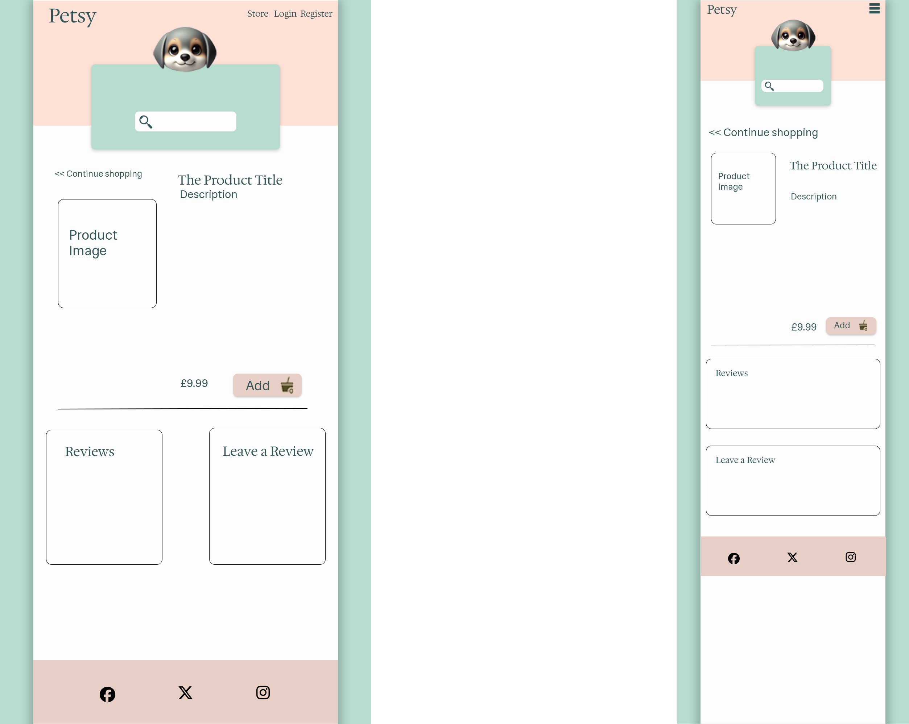
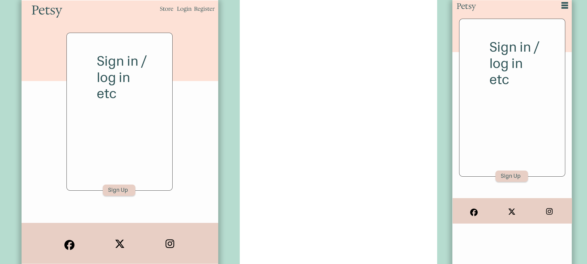
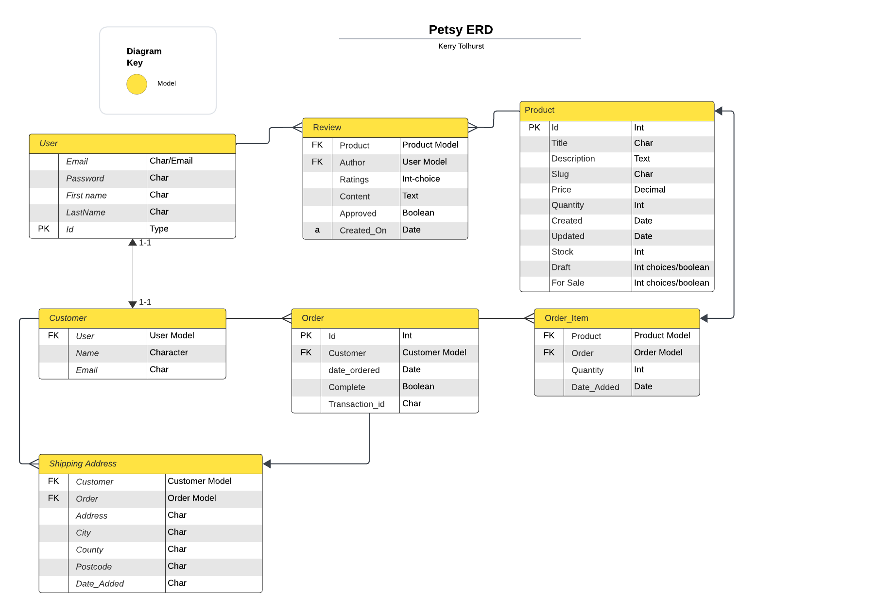

# [Petsy](https://pet-emporium-f2ff81a3d126.herokuapp.com/)
 

## Technologies 
- HTML5 
- CSS3
- Django 4
- Bootstrap 5
- Python 3
- PostgreSQL 15
- JavaScript
- Cloudinary - For hosting media files
- Git - For version control with github
- GitHub - For version control and project management
- Heroku - For deployment

## About Petsy
Petsy is my final capstone project for the Fullstack Developer Bootcamp course at code Institute. For this project we were set the task of creating a responsive, full stack web app using an MVC framework with the following specifications:
- Follow UX Design principles to build your app with user and mobile first design
- Use the agile methodoly to design and build the app
- Use authorisation, authentication and permission features
- Test using manual or autmated test
- Use a distributed version control system and a repisitory hosting service
- Deployed to a cloud-based platform
- Use object-based software concepts
- Offer users CRUD functionality without accessing the default django dashboard

I originally planned to try and use the Edx.org api to create a very basic LMS showcasing a few free programming courses a user could sign up for and review but had to switch my idea up after realising late in that their api is no longer free to access to anyone who isn't a partner organisation anymore which initially left me stumped for ideas. Then a friend asked me if I could build them a website to sell their custom made dog accessories and suddenly I was inspired. Could I? And that was where Petsy was born. 

Petsy is a simple ecommerce website that allows the site admin to list products for their users to buy and review. To start building the app I started with planning of the app with the users in mind. I stepped through how each user type might use the site and it's functionality and built user stories that helped me to fill out the features the site would have. I used Github's custom templates to use my own template to create Issues in the form of my User Stories so they would fuel my workflow. Issues were linked to my project workflow and I tracked my progress and decided what to do next based on these tasks.

## User Types and Target Audience
I identified there would be two main user types for the project, the shop admin and customers. The shop admin is small, independent, business owner looking for an online presence and shop to sell and advertise her handmade dog accessories. The target audience is dog owners with expendable income looking for something a little special for their pet.

## [User Stories](https://github.com/TolhurstTech/petsy/issues)
Click the link above to view this project's user stories and user story driven workflow

## Features - Ideation
When generating user stories I identified that the site would need the following minimum features to meet the expectations of most users when visiting a simple e-commerce website as well as the specifications for my final project:
- A responsive, dynamic, navigation bar
- An admin panel for admin to create and products as well as the website
- User login and sign up to make orders
- User cart to add items to cart
- Checkout to purchase items
- Search functionality to search products
- Be able to browse all products
- Be able to view a product's details
- Responsive mobile first design
- Displays feedback messages to the user when interacting with the site for logging in, out, registering and making comments etc.

## UXD
With the features fleshed out I started working on the design. I was immediately drawn to light pastel pink and mint green colours for my friend. I used [coloors](https://coolors.co/) to generate a colour palette with those colours in mind.

### Colour Palette

From here I built templates to lay out each page. I code better from design templates so built some semi-detailed wire frames for me to work from. The designs were built with mobile first in mind. I tried to do one for each page I could think of that I might need.

### Store / Home Page Frames

Products to display in a single column on small screens. Navbar to become a an icon with a dropdown on medium screens or smaller

### Product Detail Page

Will look basically the same on all views

### Account Pages - Login, Logout, Sign Up etc.

Very similar on all views again

### Cart Page

Small difference on Small screens. Checkout is basically the same as this so with time constraints I stopped here.

## Database Design and Django Models
Now, having a good idea of the lay out of the app, pages and data to be collected from different users I moved on to planning my database models. I was going to need a few. I sketched out some ERDs on paper before converting them digitally.

## ERD

## [Validation](VALIDATION.mg)
- I used W3C validators on the HTML output for everypage both logged in and logged out as well as for my CSS.
- I used JSLint to validate my JS.
- I used Code Institutes Python Linter to validate my python code.
Please [click here](VALIDATION.mg) to view the outputs.

## Features - Implemented

### Responsive Navbar with Dynamic Links
The navbar allows the user to navigate to the most important pages on the website. It is responsive on all screen sizes for intuitive usability and shows links relevant to logged in and out users respectively. It also displays feedback to the user that they are logged in by providing a greeting to the user if they are logged in.

### Funtioning User Cart
Given a logged in user a user can view, add, remove and adjust products within their cart.
The cart also gives a cart summary to the user of total items and price.
Guest cart functionality was out of scope for the time limits and requirements for this project. I intend to implement it fully once marked.
From the cart page, you can progress through to checking out.

### Checkout, Shipping and Payment
You can add a shipping address to your order and checkout.
The flow for checking out is implemented without a payment gateway currently as was out of scope for this project.
Checkout currently spoofs completion and closes the users current order, opening a fresh cart programmatically for the user to buy again.

### Store View With Pagination To Browse Products
A user can browse all current listed products on a clean, pageinated page, which allows them to scroll through all products.

### Product Detail View
A user can see a products details by simply clicking it to open up it's detail page.

### Add To Cart
Add to cart functionality is available for logged in users. 
Logged out users are prompted to log in to be able to use cart funtions.

### User Reviews
All users can view reviews on a product if a product has them.
Logged out users are prompted to log in to leave a review.
Logged in users can Create, Update and Delete their own reviews.
Logged in users can see, edit and delete their unapproved reviews and they are styled to look different from approved reviews.

### Admin Can Create Products
Admin can create products in the admin panel.

### Admin Panel Management
Admins can manage products, reviews and everything to do with users in the admin panel.

### Feedback Messages To User
Users are given feedback messages when interacting with the website for logging in, out, adding and deleting reviews etc.

### Footer
The footer contains links to easily find our social media as is commonly expected.

## Features - Out of Scope But Planned

### Search Functionality
So a user can search the catalogue for items they are looking for.
The search feature was a focal point of the design and functionality but I misjudged the time scale for implementing this part of the app and so it is currently just for show.

### Guest Cart
Allowing a customer to checkout without registration.
The code is ready to have guest cart implementation added but had to be spoofed for the current timescale to make sure I hit the project requirements for marking. 

### Payment Gateway
Allow a user to pay for their order.
The app is ready for payment gateway implementation and will eventually have paypal cart implemented. It was again out of scope for the requirements and time limits on this project.

### Order Management
Allow the user to view their past orders and their status.
This was also a feature planned from the start but was cut short by time constraints, too. The order page is set to be built after marking.

### Categories
Products are already stored within categories. Having category options for browsing on the store page was a planned feature. This would allwo users to browse by category opening up pages with products listed within that category to make browsing a little easier.

# [Testing](TESTING.md)
Please click the link above to see testing.

# Credits
[W3Schools](https://www.w3schools.com) - For CSS, HTML, JavaScript, and Django advice
[Bootstrap 5 documentation](https://getbootstrap.com/docs/5.3/getting-started/introduction/) - For help with Bootstrap
[Django documentation](https://docs.djangoproject.com/en/4.2/) - For Django problems
[Stack Overflow](https://stackoverflow.com/) - For finding solutions to just about every problem I had
[Dennis Ivy](https://www.youtube.com/@DennisIvy) - For [this tutorial series](https://www.youtube.com/playlist?list=PL-51WBLyFTg0omnamUjL1TCVov7yDTRng) helping me to make the basis of my shop functionality
[Code Institute Django Blog Tutorial](https://codeinstitute.net/) - For the basis of my reviews functionality
[Bing Chat with GPT-4](https://www.bing.com/) - For help trouble shooting problems and using Dall-e 3 to generate product images

