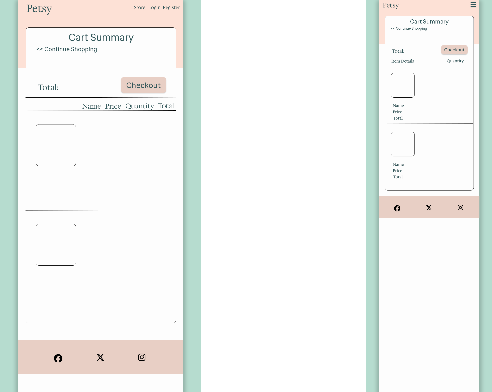

# [Petsy](https://pet-emporium-f2ff81a3d126.herokuapp.com/)

## About Petsy
Petsy is my final capstone project for the Fullstack Developer Bootcamp course at code Institute. For this project we were set the task of creating a responsive, full stack web app using an MVC framework with the following specifications:
- Follow UX Design principles to build your app with user and mobile first design
- Use the agile methodoly to design and build the app
- Use authorisation, authentication and permission features
- Test using manual or autmated test
- Use a distributed version control system and a repisitory hosting service
- Deployed to a cloud-based platform
- Use object-based software concepts
- Offer users CRUD functionality without accessing the default django dashboard

I originally planned to try and use the Edx.org api to create a very basic LMS showcasing a few free programming courses a user could sign up for and review but had to switch my idea up after realising late in that their api is no longer free to access to anyone who isn't a partner organisation anymore which initially left me stumped for ideas. Then a friend asked me if I could build them a website to sell their custom made dog accessories and suddenly I was inspired. Could I? And that was where Petsy was born. Petsy is a simple ecommerce website that allows the site admin to list products for their users to buy and review. To start building the app I started with planning of the app with the users in mind. I stepped through how each user type might use the site and it's functionality and built user stories that helped me to fill out the features the site would have. I used Github's custom templates to use my own template to create Issues in the form of my User Stories so they would fuel my workflow. Issues were linked to my project workflow and I tracked my progress and decided what to do next based on these tasks.

## [User Stories](https://github.com/TolhurstTech/petsy/issues)
Click the link to view this project's user stories

## Features
When generating user stories I identified that the site would need the following minimum features to meet the expectations of most users when visiting a simple e-commerce website as well as the specifications for my final project:
- A responsive, dynamic, navigation bar
- An admin panel for admin to create and products as well as the website
- User login and sign up to make orders
- User cart to add items to cart
- Checkout to purchase items
- Search functionality to search products
- Be able to browse all products
- Be able to view a product's details
- Responsive mobile first design
- Displays feedback messages to the user when interacting with the site for logging in, out, registering and making comments etc.

## UXD
With the features fleshed out I started working on the design. I was immediately drawn to light pastel pink and mint green colours for my friend. I used [coloors](https://coolors.co/) to generate a colour palette with those colours in mind. 

From here I built templates to lay out each page. I code better from design templates so built some semi-detailed wire frames for me to work from. The designs were built with mobile first in mind. I tried to do one for each page I could think of that I might need.

### Store / Home Page Frames

Products to display in a single column on small screens. Navbar to become a an icon with a dropdown on medium screens or smaller

### Product Detail Page

Will look basically the same on all views

## Account Pages - Login, Logout, Sign Up etc.

## Cart Page

